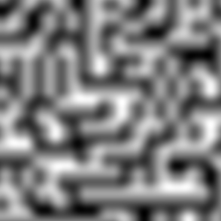
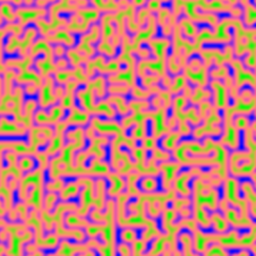

# Assignment 1: NumPy Array Manipulation for 2D Pattern Generation

[View on GitHub]({{ site.github.repository_url }})

## Table of Contents

- [Project Overview](#project-overview)
- [Pseudo-Code](#pseudo-code)
- [Technical Explanation](#technical-explanation)
- [Results](#results)
- [References](#references)

---

## Project Overview

This project implements a 2D Perlin Noise field generator using NumPy arrays. It defines a grid of gradient vectors whose influence is smoothly blended across the canvas using ``fade(t)`` and ``lerp(a, b, t)`` to create a continuous pattern. After normalizing the noise, the 2D data is expanded to 3D RGB. For a creative design, an array offset ``np.stack()`` is applied to the Red and Blue channels. Finally, channel-specific mathematical transformations (``np.stack()``, linear, inverse linear) map intensity to a custom color palette, demonstrating advanced array manipulation for procedural content generation.

---

## Pseudo-Code

1. **Initialize Variables**
   - Define the canvas dimensions (height and width) to determine the resolution.
   - Set the scale factor (frequency) to control the size and complexity of the noise features.
   - Initialize the 2D canvas array using `np.zeros()`.

2. **Define Helper Functions**
   - **Gradient Generator**: Functionally create a grid of randomly oriented unit vectors (gradients) that influence the resulting noise in each cell.
   - **Fade function** (`fade`): Apply a non-linear smoothing curve to interpolation factors to prevent visual discontinuities (seams) at the boundaries between grid cells.
   - **Interpolation function** (`lerp`): Implement a weighted average formula to smoothly blend between two calculated values.

3. **Prepare the Grid**
   - Calculate the required grid size based on the canvas dimensions and scale factor.
   - Execute the Gradient Generator to assign a unique random gradient vector to every corner point of the grid.

4. **Generate Noise Pattern**
   - For each pixel in the canvas:
      - Determine the four surrounding grid corner coordinates that define the pixel's containing cell.
      - Calculate the pixel's relative position (fractional distance from 0 to 1) within that cell.
      - Compute the influence of each of the four corner gradients by calculating the dot product between the corner's gradient vector and the distance vector to the pixel.
      - Apply the **fade function** (`fade`) to the relative position coordinates to get smoothed interpolation weights.
      - Use the **interpolation function** (`lerp`) to blend the four corner influences: first horizontally (creating top and bottom edge values) and then vertically (blending the top and bottom edge values) to get the final noise value for that pixel.

5. **Normalize Values**
   - Rescale the entire array of raw noise values (which are typically in a negative to positive range) to a consistent 0 to 1 range. This prepares the data for mapping to grayscale and color intensity.

6. **Visualize and Save Grayscale Image**
   - Map the normalized 0-1 noise array to a grayscale image (0=black, 1=white).
   - Display and save the resulting 2D grayscale pattern.

7. **Add Color (RGB Transformation)**
   - Expand the 2D array into a 3D array with three channels (R, G, B) using `np.stack()`.
   - Introduce complexity by creating a slightly offset version of the base noise array to be used for the Red and Blue channels.
   - Apply channel-specific mathematical transformations to the noise data to assign color:
      - Red: Map using a sine function to emphasize mid-tones.
      - Green: Map linearly to increase with brightness.
      - Blue: Map inversely to dominate dark areas.
   - Clip the final 3D array values to the valid color range (0-255)
   
8. **Display and Save Colorized Image**
   - Display and save the final 3D colorized image.

---

## Technical Explanation

In this assignment, I began by initializing a blank canvas using `np.zeros()`, creating a 2D array to represent the pixel grid of the image. The canvas dimensions were defined by height and width parameters, determining the resolution of the generated pattern.

To generate the perlin noise, the canvas was divided into a grid. A random gradient vector was assigned to each grid point using `np.random.randint()` and predefined vectors. Each pixel’s final noise value was computed based on its distance from the surrounding four grid corners and the dot products between the distance and gradient vectors.

The core of the smoothness relies on two functions:
- `lerp(a, b, t)` (Linear Interpolation): This fundamental array operation, given by $(a + t * (b - a))$, calculates the weighted average between two values ($a$ and $b$) based on a blending factor ($t$). It is used repeatedly to blend the corner influences first horizontally and then vertically, creating the continuous noise field.

- `fade(t)` (Smoothing Curve): The function $(6t^5 - 15t^4 + 10t^3)$ is a standard perlin noise smoothing curve. Its purpose is non-linear, it forces the positional derivative to zero at $t=0$ and $t=1$. This ensures that the blended values approach the grid boundaries very smoothly, effectively eliminating the harsh, visible seams that straight linear interpolation would otherwise produce.

The resulting raw noise values, which ranged between negative and positive numbers, were normalized to a standard 0–1 scale. This normalization was essential to map the noise data correctly to grayscale intensity values.

To create a colorized version, I used `np.stack()` to extend the 2D array into a 3D RGB array. Each color channel was then manipulated individually, assigning different relationships to create some variation: the red channel was based on a sine transformation done by `np.sin`, the green channel increased with brightness and the blue channel decreased with it. This introduced a color transition, corresponding to the noise intensity.

The final image was clipped to the valid color range *(0-255)* using `np.clip()`, visualized with `plt.imshow()` and saved using `plt.savefig()`, giving both grayscale and colorized visual representations of the generated Perlin noise pattern.

---

## Results

Shown here is the result image, displaying both the grayscale version and the version where a third array has been added as an RGB channel. 

 
*Figure 1: The normalized scalar noise field rendered in grayscale.*

*Figure 2: The final output where scalar values are mapped to RGB channels using sine and linear functions.*

---

## References

- Perlin Noise Overview [Perlin noise](https://en.wikipedia.org/wiki/Perlin_noise)
- Perlin Noise Algorith Explanation [Perlin Noise: A Procedural Generation Algorithm](https://rtouti.github.io/graphics/perlin-noise-algorithm)
- Perlin Noise Mathematics [Simplex noise demystified](https://www.researchgate.net/publication/216813608_Simplex_noise_demystified)

---