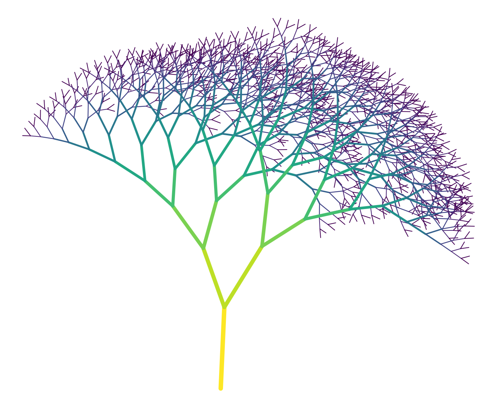
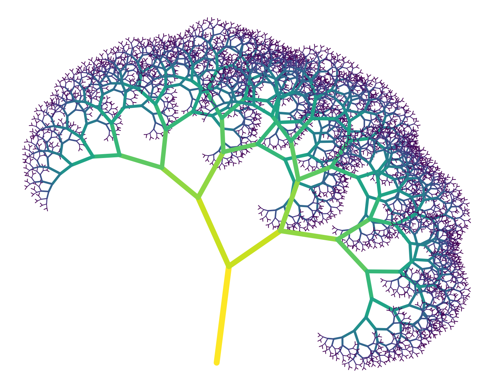
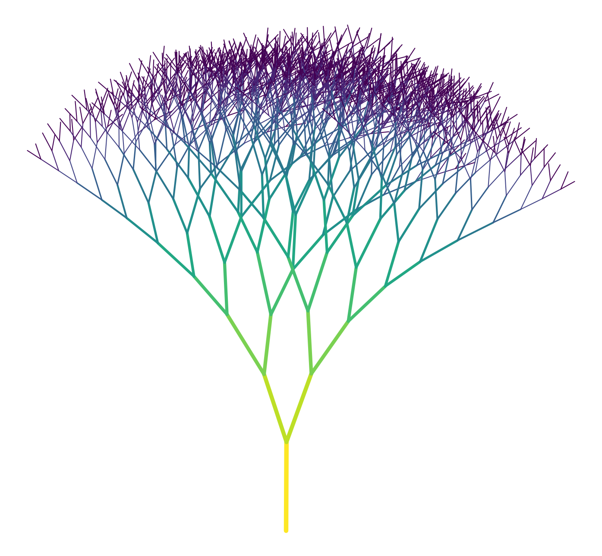
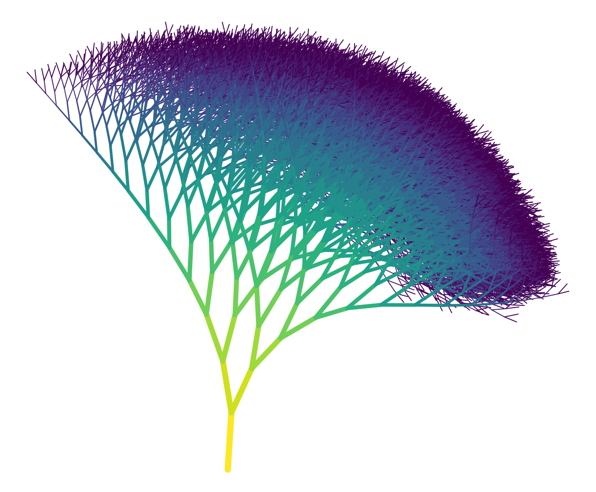
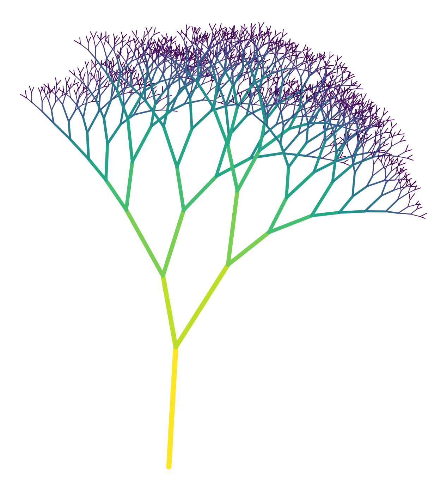
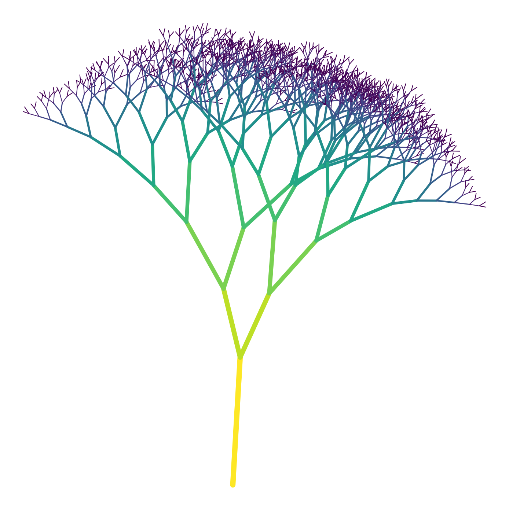
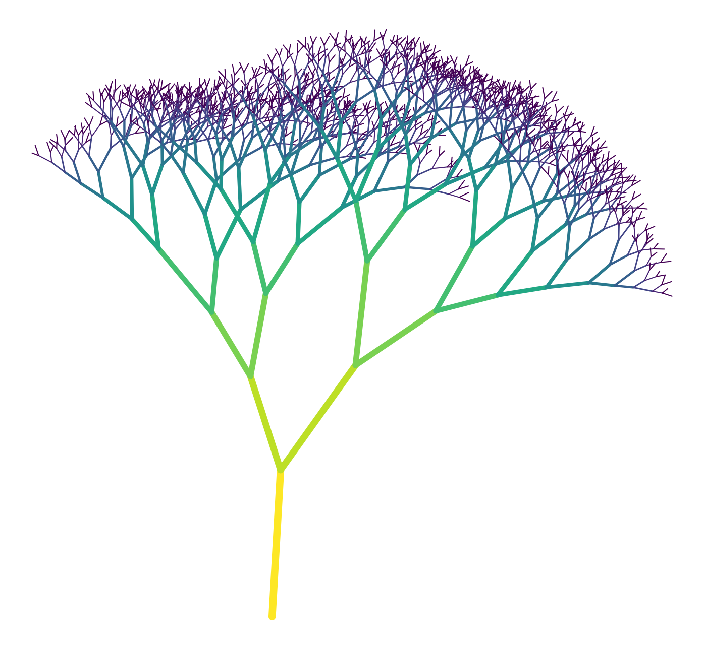

# Assignment 2: Fractal Generation Documentation

[View on GitHub]({{ site.github.repository_url }})


## Table of Contents

- [Project Overview](#project-overview)
- [Pseudo-Code](#pseudo-code)
- [Technical Explanation](#technical-explanation)
- [Geometric Influences](#geometric-influences)
- [Parameters & Seeds](#parameters--seeds)
- [Appearance Mapping](#appearance-mapping)
- [Experiments](#experiments)
- [Challenges and Solutions](#challenges-and-solutions)
- [References](#references)

---

## Project Overview

This project implements a recursive geometric fractal generator, utilizing Matplotlib and Shapely, to create complex, organic tree-like structures. The core recursive algorithm applies geometric rules (scaling and rotation) to achieve self-similarity. To ensure a natural, non-rigid appearance, the fractal's growth path is influenced by stochastic variation in branch length, a point attractor, and a uniform directional field. Final visualization maps line color and width based on the branch's recursion depth, effectively highlighting the hierarchical structure.

---

## Pseudo-Code

1. **Define Main Function `generate_fractal(start_point, length, theta, depth, max_depth, angle, ratio, initial_width, attractor=None, field_strength=0.1, field_direction=np.pi/2)`**
   - **Inputs**:
     - `start_point`: Tuple `(x, y)`, the root coordinate of the fractal.
     - `length`: Length of the current branch segment.
     - `theta`: Current branch angle (in radians).
     - `depth`: Current recursion depth.
     - `max_depth`: Maximum recursion depth.
     - `angle`: Angle offset (branching angle).
     - `ratio`: Scaling factor controlling the reduction of length per recursion.
     - `initial_width`: Base width used for line thickness scaling.
     - `attractor`: Optional point influencing the direction of growth.
     - `field_strength`: Strength of the directional field influence.
     - `field_direction`: Global directional bias of the field (in radians).

   - **Process**:
     - **If** `depth > max_depth`:  
       - **Return** (end recursion).
     - **Else**:
       1. Compute `end_point` using trigonometry:
          - `x1 = x0 + length * cos(theta)`
          - `y1 = y0 + length * sin(theta)`
       2. Apply **geometric influences**:
          - **Attractor influence:** Slightly bend the angle toward the attractor point.
          - **Field influence:** Adjust the angle toward the global field direction.
       3. Store the resulting line segment as a Shapely `LineString`.
       4. Append the segment to a global list for later visualization.
       5. Calculate the next branch length:  
          - `new_length = length * ratio`
       6. Recursively call `generate_fractal` for two branches:
          - Left branch: `theta + angle`
          - Right branch: `theta - angle`
       7. Continue recursion until the maximum depth is reached.


2. **Initialize Parameters**
   - Set `start_point`, `length`, `theta`, `depth`, `max_depth`, `angle`, `ratio`, `initial_width`, `attractor`, `field_strength`, `field_direction`
   - ``` python
     random.seed(seed)  # seed recorded in [Parameters & Seeds](#parameters--seeds)
     ```


3. **Visualization**
   - Collect all line segments stored during recursion.
   - Use **Matplotlib** to visualize:
     - Line width mapped to recursion depth.
     - Color mapped to local depth.
---

## Technical Explanation

### Recursion Logic

The ``generate_fractal`` function is the fundamental element, embodying the rule for creating self-similar growth.
1. **Base Case**: The function terminates when the current recursion depth exceeds max depth, preventing infinite execution.

2. **State Transformation**: Each recursive call defines a new state for the child branches, a reduced length ($L_{new} = L_{old} \cdot {ratio}$) and two new angles ($\theta_{new} = \theta_{old} \pm \text{angle}$).

### Vector Calculation and Geometric Influences

The position of the new branch end-point $(x_1, y_1)$ is calculated relative to the start-point $(x_0, y_0)$ using basic vector transformation based on the segment's length ($L$) and angle ($\theta$):
   ```python
  x1 = x0 + length * cos(theta)
  y1 = y0 + length * sin(theta)
   ```
This calculation uses the modified length, which incorporates variation: 
- Stochastic Branch Length (``rand_len``): Before the end-point is calculated, the segment's length is randomized within a controlled range. Using ``random.uniform`` the value is used in the end-point calculation, introducing slight variation in branch lengths for a more organic, natural appearance, preventing a rigidly symmetric structure.

Crucially, the angle $\theta$ is not fixed, it is adjusted before calculation by two geometric forces:
1. **Attractor Influence**: The angle $\theta$ is subtly bent toward a fixed global point $(a_x, a_y)$. This is achieved by blending the current branch angle with the angle pointing directly at the attractor, introducing asymmetry and curving the branches toward a target.
   ```python
   theta += (attract_angle - theta) * 0.1
   ```

2. **Uniform Directional Field**: The angle $\theta$ is also nudged toward a fixed ``field_direction``. This simulates an external force and is scaled by ``field_strength`` to bias the overall growth orientation.
   ```python
   theta += (field_direction - theta) * field_strength
   ```

### Data Handling and Visualization Mapping

Each branch is stored as a Shapely ``LineString`` object in a global list, along with its recursion depth. This choice is good for two reasons:
1. **Post-Processing**: It separates the generation phase from the visualization phase.
2. **Mapping**: By storing the depth, it enables the color and line width of the segment to be mapped based on its hierarchical position after the recursion completes.


### Mathematical Principles

- **Trigonometry:** Calculates the position of branch end points based on length and angle.
- **Recursion:** Each branch generates smaller branches, creating self-similarity.
- **Linear scaling (`ratio`):** Ensures each child branch is smaller than its parent.
- **Weighted angle influences:** Introduce controlled deviation toward attractors and fields while preserving overall structure.

---

## Geometric Influences


1. **Attractor Point**
   - **Type:** point attractor
   - **Computation:** At each recursion step, the angle of the current branch is slightly adjusted toward a fixed attractor point. This is done by computing the angle between the branch start point and the attractor, then blending it with the current branch angle:
     ```python
     attract_angle = math.atan2(ay - y0, ax - x0)
     theta += (attract_angle - theta) * 0.1
     ```
   - **Effect on Growth:** The attractor subtly curves branches toward a chosen location, influencing the overall tree shape without overriding the self-similar fractal pattern. It affects every branch as the recursion progresses, introducing asymmetry and more natural variation.

2. **Uniform Directional Field**
   - **Type:** global field influence
   - **Computation:** Each branch is slightly bent toward a fixed field direction at every recursion step. The influence is scaled by a `field_strength` parameter:
     ```python
     theta += (field_direction - theta) * field_strength
     ```
   - **Effect on Growth:** The field biases the overall growth direction of the tree (e.g., simulating gravity or wind). It acts globally on all branches during recursion, giving the fractal a cohesive orientation while still allowing stochastic variation in branch lengths and angles.

---

## Parameters & Seeds

| Figure | Depth D | Angle Δ | Theta Δ | Length L | Scale s | Width W | Attractor () | Field Δ | Seed |
|---|---|---|---|---|---|---|---|---|---|
| 1 | 10 | 30° | 90° | 100 | 0.8 | 3.0 | (100,200) | 0.1/90° | 10 |
| 2 | 12 | 45° | 90° | 120 | 0.75 | 4.0 | (300,100) | 0.02/80° | 24 |
| 3 | 10 | 25° | 90° | 100 | 0.85 | 2.5 | (150,400) | 0.15/100° | 7 |
| 4 | 14 | 20° | 90° | 80 | 0.9 | 3.5 | (200,250) | 0.05/90° | 33 |

---

## Results

 
 


## Appearance Mapping

- **Color**:  
  - The color of each branch is determined by its recursion depth.  
  - The `get_color(depth, max_depth)` function maps the depth to a colormap (`viridis`)
  - This gradient highlights the hierarchical structure of the tree and makes it easier to visually distinguish different branch levels.

- **Line Width**:  
  - The line width tapers from the trunk to the tips.  
  - The `get_line_width(depth, initial_width, max_depth)` function decreases line thickness linearly with depth, so **the trunk is thick and major branches are prominent, while smaller branches become thinner**.  
  - This mimics natural tree growth and emphasizes the main structure versus finer details.

- **Randomized Branch Length**:  
  - Branch lengths are slightly randomized (`rand_len = random.uniform(0.75, 1.0) * length`) to give the tree a more organic, natural appearance.  
  - This stochastic variation ensures that even with the same parameters, the fractal has subtle visual differences between runs if a different seed is used.

---

## Experiments

- **Seed effect**: Changing the seed now affects both branch length and branch angles, producing noticeably different tree shapes even with the same base parameters.  
- **Branching angle variation**: Seeds introduce controlled deviations in the branching angle, adding diversity while keeping trees structurally consistent.  
- **Length variation**: Randomized branch lengths contribute to a natural, organic look.

### Parameters and Influences
| Depth D | Angle Δ | Theta Δ | Length L | Scale s | Width W | Attractor () | Field Δ |
|---|---|---|---|---|---|---|---|
| 10 | 30° | 90° | 80 | 0.75 | 3.0.5 | (200,250) | 0.15/90° |

|  | Figure 1 | Figure 2 | Figure 3 | Figure 4 |
|---|---|---|---|---|
| **Seed** | 42| 31415 | 9000 | 451 |

 
 

### Conclusion

The experiments show that even small variations introduced by the seed can meaningfully influence the fractal’s appearance. This allows for reproducible yet visually distinct outcomes, highlighting the importance of controlling randomness in procedural generation.


---

## Challenges and Solutions

- **Challenge**: Introducing randomness in branch length without breaking the overall tree structure.  
  - **Solution**: Randomness was applied within controlled bounds (`rand_len = random.uniform(0.75, 1.0) * length`), so each branch varied slightly in length while keeping the general shape consistent.

- **Challenge**: Tuning the attractor influence to bend branches noticeably without over-distorting the fractal.  
  - **Solution**: The attractor’s effect was scaled (`theta += (attract_angle - theta) * 0.1`) to subtly influence the branches. This required experimentation to achieve a visible but balanced bending effect.

- **Challenge**: Controlling the influence of the uniform field so branches maintain an overall upward growth without flattening or over-bending.  
  - **Solution**: Scaled the field influence (`field_strength`) to a low value and tuned it experimentally.

- **Challenge considered**: Making the random seed influence not only branch lengths but also branching angles for reproducibility.  
  - **Note**: This was not implemented, but could provide more predictable variation across runs and would allow the seed to fully control the fractal’s shape.

---

## References

- **Fractal Trees Understanding**: [https://www.jernesto.com/articles/fractal_trees](https://www.jernesto.com/articles/fractal_trees)
- **Fractal Tree Inspiration**: [https://www.tomchaplin.xyz/blog/2019-03-24-windy-random-fractal-trees/](https://www.tomchaplin.xyz/blog/2019-03-24-windy-random-fractal-trees/)

---