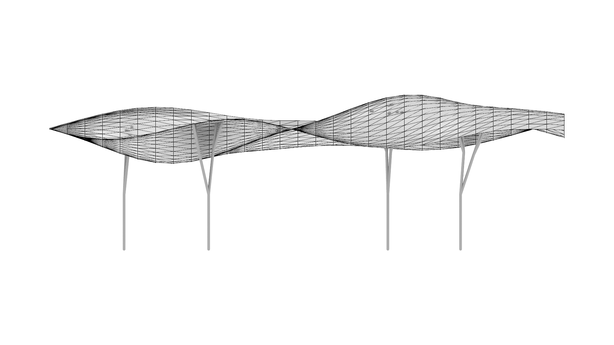
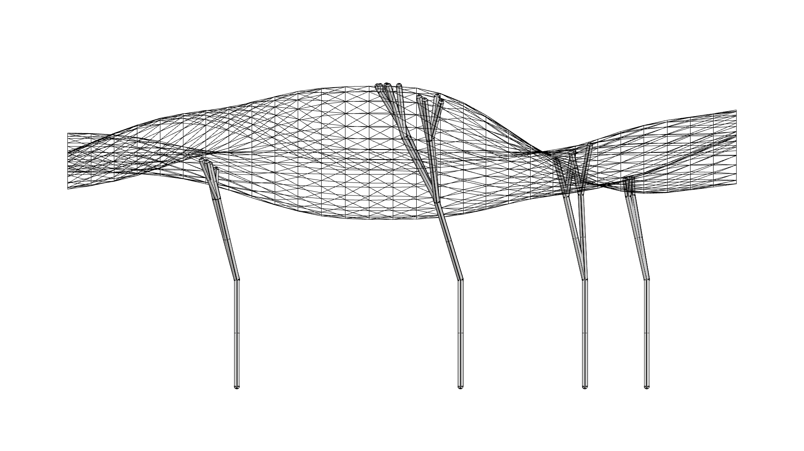
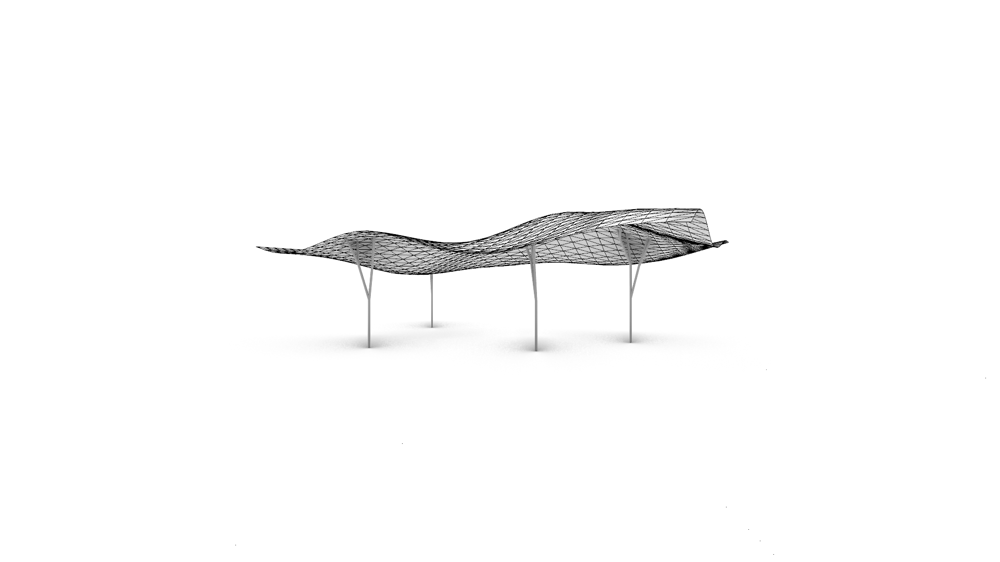
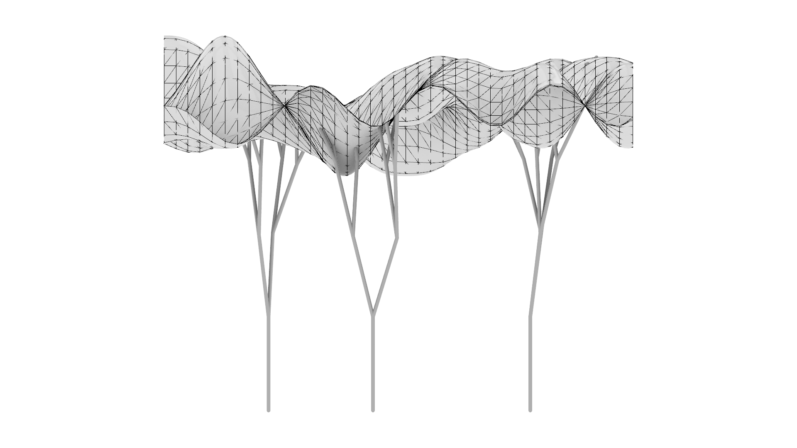
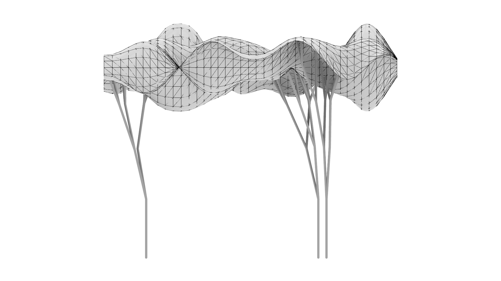
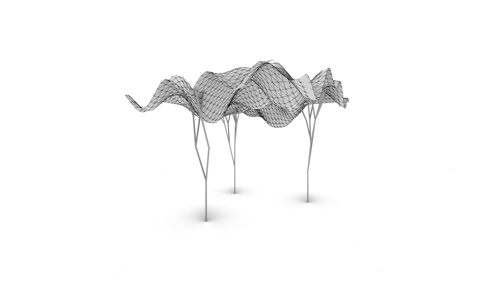
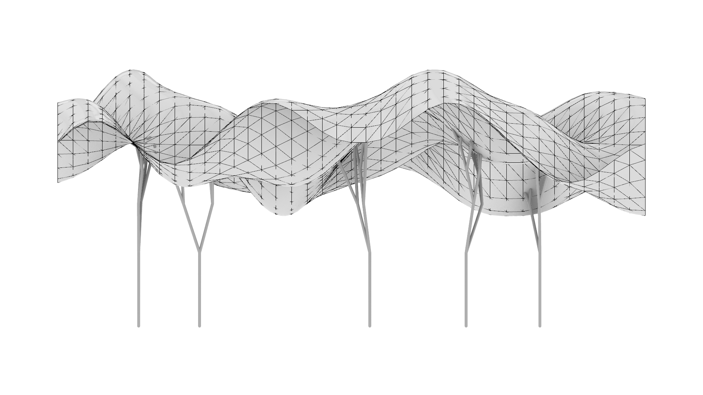
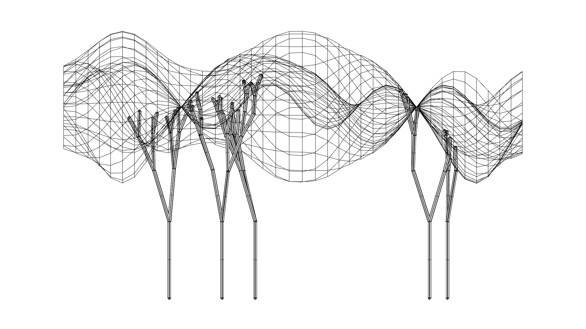
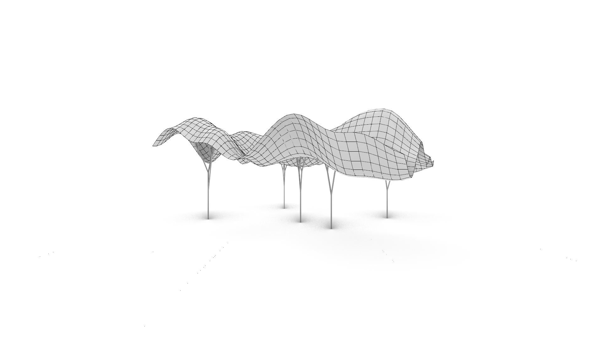

# Assignment 3: Parametric Structural Canopy

[View on GitHub]({{ site.github.repository_url }})

## Table of Contents

- [Pseudo-Code](#pseudo-code)
- [Technical Explanation](#technical-explanation)
- [Design Variations](#design-variations)
- [Challenges and Solutions](#challenges-and-solutions)
- [References and AI Acknowledgments](#references-and-ai-acknowledgments)

---

## Pseudo-Code

```python
# 0. Prepare Inputs.

seed  # random seed
sizeX, sizeY, canopy_height  # base surface for canopy
divU, divV  # sampling resolution
amplitude, scale  # heightmap controls
use_triangles  # tesselation type (Boolean)
user_anchors  # anchor points (user-selected points or random points on surface)
rec_depth, br_length, len_reduct, n_branches  # branching controls
pipe_radius  # support thickness

# 1. Set random seeds for reproducibility.

seed_everything(seed)


# 2. Build UV Grids — create uniform U,V samples for evaluation.

U, V = uv_grid(divU, divV)


# 3. Compute Heightmap — produce a scalar field H over U,V that will drive displacement.

H = heightmap_perlin(U, V, amplitude=amplitude, scale=scale) # Implementation uses Perlin Noise


# 4. Create Source Point Grid — make a planar XY grid.

P_src = make_point_grid_xy(divU, divV, origin=(0,0,0), size=(sizeX, sizeY))


# 5. Deform Points with Heightmap — offset along Z for planar grids.

P_def = manipulate_points_z(P_src, H)


# 6. Construct Canopy Surface — build a NURBS surface from the deformed point grid and move Z-min to canopy_height.

surf = surface_from_point_grid(P_def, canopy_height)


# 7. Uniformly Sample the Surface — generate a regular point grid on the new surface for panelization.

Sgrid = sample_surface_uniform(surf, divU, divV)


# 8. Tessellate into Panels — convert each cell of `Sgrid` into triangular (Design B) or quad (Design A) panels.

if use_triangles:
    panels = tessellate_triangles_from_grid(Sgrid)
else:
    panels = tessellate_quads_from_grid(Sgrid)


# 9. Choose Support Anchors — choose user points or fall back to random points, projecting them to Z=0.

roots = get_user_or_random_anchors(user_anchors, surf, fallback_count=4)


# 10. Generate Supports — grow a branching structure from the anchors using recursive ray-casting rules.

supports = generate_supports(
    roots,
    surf, # Surface passed for intersection check
    depth=rec_depth,
    length=br_length,
    length_reduction=len_reduct,
    n_children=n_branches,
    seed=seed,
    pipe_radius=pipe_radius # Constant thickness
)


# 11. Set Component Outputs

out_surface 	 = surf
out_tessellation = panels
out_supports 	 = supports
```

#### `heightmap_perlin(U, V, amplitude, scale, seed)`
**Description**: Define a continuous **Perlin Noise** scalar field **H** over the UV domain. The values in **H** control the vertical displacement of the canopy points.

**Inputs**: U (2D grid), V (2D grid), parameters (`amplitude`, `scale`, `seed`).

**Outputs**: H (2D array) same shape as U,V.

**Assumptions**: U,V are normalized to [0,1].

```text
Initialize an empty 2D array H with same dimensions as U, V.
Apply seed for reproducibility.
For each cell (i,j):
  Read u = U[i,j], v = V[i,j].
  Map (u, v) to scaled coordinates (u_s, v_s) using 'scale'.
  Compute Perlin Noise value 'h' at (u_s, v_s) using gradient interpolation.
  Store h in H[i,j].
Normalize H to range [-1, 1].
Scale H by 'amplitude'.
Return H.
```

---

#### `manipulate_points_z(point_grid, H)`
**Description**: Deform a planar point grid by lifting (or lowering) points along the **+Z axis** using the scalar height array **H**.

**Inputs**: `point_grid` (2D list of 3D points), **H** (2D array, same indexing).

**Outputs**: **P_def** (deformed point_grid).

**Assumptions**: `point_grid` and **H** have identical row/column counts.

**Pseudocode**:
```text
Initialize an empty grid P_def.
For each cell (i,j):
  Read point p from point_grid[i,j] and height h from H[i,j].
  Create p' by offsetting p by h units along the Z axis (p'.Z = p.Z + h).
  Store p' into P_def[i,j].
Return P_def.
```


---

#### `surface_from_point_grid(point_grid, canopy_height)`
**Description**: Build a single continuous **NURBS surface** from the deformed rectangular point grid and adjust the surface's vertical position..

**Inputs**: `point_grid` (2D rectangular array fo 3D points): the **P_def** grid, canopy_height (desired minimum Z-level for the surface)

**Outputs**: `surf` (surface identifier/GUID) or null on failure.

**Assumptions**: Grid is rectangular and ordered row‑major; points are reasonably regular.

**Pseudocode**:
```text
Validate grid dimensions (rows ≥ 2, cols ≥ 2).
Flatten the points in row-major order.
Call surface creation routine (rs.AddSrfPtGrid) to fit a NURBS surface 'surf' through the points.

If surf is valid:
    Find Z_min, the lowest point on surf.
    Calculate vertical translation vector V = (0, 0, canopy_height - Z_min).
    Translate surf by V.

Return the created surface id (or null if the operation fails).
```

---

#### `tessellate_panels_from_grid(point_grid)`
**Description**: Convert a sampled point grid on the canopy surface into a set of planar **quad/triangular panels**.

**Inputs**: `point_grid` (2D array of points): A uniformly sampled grid **S_grid** on the final canopy surface

**Outputs**: `panels` (list of panel identifiers), where each panel is a 3‑point NURBS surface.

**Assumptions**: Neighboring cells form quads with points (i,j),(i,j+1),(i+1,j),(i+1,j+1).

**Pseudocode**:
```text
Initialize an empty list panels.
For each interior cell (i from 0..rows-2, j from 0..cols-2):
  Collect the four corner points: 
  a = point_grid[i,j]
  b = point_grid[i,j+1]
  c = point_grid[i+1,j+1]
  d = point_grid[i+1,j]

  // Split the quad (a, b, c, d) into two triangles:
  panel1 = Create 3-point NURBS surface using (a, b, c).
  panel2 = Create 3-point NURBS surface using (a, c, d).

  Append created panel IDs (panel1, panel2) to the list.
Return panels.
```

---

#### `get_user_or_random_anchors(user_anchors, surf, fallback_count)`
**Description**: Uses user-provided anchor points; if none are provided, generates random points on the surface, and projects all valid points to the **Z=0 ground plane** to create the root GUIDs.

**Inputs**: `user_anchors` (list of point inputs, optional), `surf` (surface identifier), `fallback_count` ((int) number of random points to generate if `user_anchors` is empty).

**Outputs**: `roots` (list of point identifiers/GUIDs).

**Assumptions**: `surf` is a valid Brep/surface.

**Pseudocode**:
```text
Initialize valid_coords = [] (to store coordinates on the canopy surface).

If user_anchors is provided and non-empty:
    Coerce and collect coordinates from user_anchors into valid_coords.

If valid_coords is still empty (fallback needed):
    valid_coords = generate_random_surface_points(surf, fallback_count).

Initialize final_anchors = [] (to store the final GUIDs).
For each pt in valid_coords:
    x = pt.X; y = pt.Y
    ground_coords = (x, y, 0.0) // Project Z to ground
    point_guid = rs.AddPoint(ground_coords)
    Append point_guid to final_anchors.

Return final_anchors.
```

---

#### `generate_supports(roots, surf, ...`
**Description**: Generate a branching support structure starting at ground anchor points (`roots`) using **ray-casting** to truncate branches at the canopy surface (`surf`).

**Inputs**: `roots` (list of anchor points), `surf`(Brep), parameters (`depth`, `initial length`, `reduction`, `children count`, `pipe radius`, `seed`).

**Outputs**: `supports` (list of pipe surface identifiers/GUIDs).

**Assumptions**: Root points are valid GUIDs (Z=0); recursion depth is non-negative.

**Pseudocode**:
```text
Initialize an empty list supports.
Convert surf to canopy_brep (RhinoCommon).

Define a recursive procedure BRANCH(point, direction, remaining_depth, length):
  Initialize segment_results = [] // Local accumulator
  If remaining_depth == 0 → return segment_results.

  // Ray-Casting & Intersection (Truncation)
  Extend ray from point in direction. Check intersection against canopy_brep.
  Set final_end_pt to intersection point (if hit) or full length endpoint (if miss).

  // Geometry Creation (Constant Thickness & Robustness)
  If segment_length > MIN_LENGTH_THRESHOLD:
      Create pipe geometry (constant radius pipe_radius).
      Add pipe GUIDs to segment_results.

  // Recursive Step
  If NOT hit_roof AND remaining_depth > 1:
      Calculate new_length.
      For each of n_children:
          Jitter direction.
          child_guids = BRANCH(final_end_pt, new_dir, remaining_depth - 1, new_length).
          segment_results.extend(child_guids). // Accumulate results

  Return segment_results.

For each root in roots: 
    root_guids = BRANCH(root, direction=[0,0,1], depth, length).
    supports.extend(root_guids).

Return supports.
```

---

## Technical Explanation

The final structural canopy is generated through a controlled sequence of geometric processes, primarily leveraging **NumPy** for robust array manipulation and **RhinoScriptSyntax/RhinoCommon** for surface operations and ray-casting.

1. **Heightmap Generation**
    
    A 2D scalar field, H, is computed using a simplified Perlin Noise algorithm, from assignment 1, implemented with NumPy. This procedural approach generates natural, smooth variation determined by the ``amplitude` (overall Z-scaling) and `scale` (frequency/repetition) parameters. The resulting values are normalized and centered around zero for balanced deformation.
    - Reference: `heightmap_perlin(U, V, amplitude=1.0, scale=10.0, seed=None)`

2. **Point Grid Creation**

   The process begins with creating a planar XY grid of points (`P_src`) using NumPy's `linspace` and `meshgrid` to establish uniform spacing across the defined `sizeX` and `sizeY` domains. The origin of the grid is typically set at (0, 0, 0).
   - Reference: `make_point_grid_xy(divU, divV, origin=(0.0, 0.0, 0.0), size=(10.0, 10.0))`

3. **Point Grid Manipulation**
   
    The planar grid is deformed by offsetting each point along the global Z-axis using the height value read from H (`P_def`). This simple Z-offset is appropriate for a base that starts as a flat plane.
   - Reference: `manipulate_points_z(point_grid, H)`

4. **Surface Construction**

   The deformed points (`P_def`) are used to construct a single, continuous **NURBS surface** (`surf`) using `rs.AddSrfPtGrid`. The surface is then translated vertically so that its lowest point rests at the specified `canopy_height`.
   - Reference: `surface_from_point_grid(point_grid, canopy_height)`

5. **Tessellation**

   The final canopy surface is sampled to generate a regular point grid (`Sgrid`). These points define an initial structure of **quadrilateral cells**. Because the deformed surface is non-planar, each quad cell is broken down into two, planar **triangular NURBS panels** (`tessellate_triangles_from_grid`).
   - Reference: `tessellate_panels_from_grid(Sgrid)` or `tessellate_triangles_from_grid(Sgrid)`

6. **Support Structure Generation**

   The supports use a depth-controlled **recursive branching algorithm** combined with **ray-casting** for collision detection. Each branch segment extends upward until it **intersects the canopy surface** (`surf`) or reaches its full length. The segments are visualized as solid geometry using `rs.AddPipe` with a **constant** `pipe_radius` thickness. Crucially, the anchor points (roots) are **projected to the Z=0 plane** before generation begins.
   - Reference: `generate_supports(roots, surf, depth=3, length=5.0, length_reduction=0.7, n_children=2, pipe_radius=0.3, seed=None)`


---

## Design Variations

### Parameter Tables

| Design | sizeX | sizeY | canopy_height | divU | divV | amplitude | scale | tesselation_type | rec_depth | br_length | len_reduct | n_branches | pipe_radius | seed |
|--------|------:|------:|--------------:|-----:|-----:|----------:|------:|-----------------:|----------:|----------:|-----------:|-----------:|------------:|-----:|
|    A   |   30  |   20  |      5.0      |  30  |  30  |    2.0    |  2.2  | triangles (true) |     5     |    3.2    |     0.8    |      2     |     0.08    |  10  |
|    B   |   10  |   10  |      5.0      |  40  |  40  |    1.5    |  4.0  | triangles (true) |     5     |    2.0    |     0.9    |      2     |     0.04    |   7  |
|    C   |   40  |   30  |      7.5      |  40  |  40  |    5.0    |  3.6  | quads    (false) |     7     |    5.0    |     0.7    |      2     |     0.10    |  33  |

1. **Variation A**

   
   
    


2. **Variation B**

   
   
   

3. **Variation C**

   
   
   


---

## Challenges and Solutions

| Challenge | Description | Solution |
|:--------|:------|:------|
| Recursive Accumulation Failure | The initial recursive function structure failed to reliably collect all generated support GUIDs, often resulting in an empty or incomplete output list (`supports = []`). This was due to errors in handling local list scopes within the nested recursive calls. | Refactored the `recursive_branch` function to initialize and return a local list (`segment_results`) of GUIDs, which is explicitly captured and merged (`list.extend()`) by the parent function call, ensuring all geometry is collected up the call stack. |
| Silent Pipe Creation Failure | Very short line segments (e.g., last branches hitting the canopy at a shallow angle or microscopic errors) caused the geometry function `rs.AddPipe` to fail, returning `None` GUIDs which brooke the geometry list. | Implemented a check (`segment_length > MIN_LENGTH_THRESHOLD`) before line creation. This ensures that only segments with sufficient length are piped, preventing failures caused by degenerate geometry. |
| Missing Anchor Input | The script depends on the mandatory `Anchor Points` list. When this input is empty, the script silently exits without creating geometry, confusing the user. | Implemented a **Fallback Anchor Generation Protocol**. If the `Point` list is empty, it requires a preceding component (like **Populate Geometry**) to automatically scatter default anchor points onto the base surface. |
| Complex Tapered Geometry | The initial attempt to implement depth-based thickness tapering was unstable, complex to debug, and prone to failures when radii became extremely small near terminal branches. | Simplified the geometry by using a single, constant `pipe_radius` for both the start and end of every branch segment. |
---

## References and AI Acknowledgments

- **Python for CAD Applications**:
  - [RhinoScriptSyntax](https://developer.rhino3d.com/api/RhinoScriptSyntax)
  - [RhinoCommon SDK](https://developer.rhino3d.com/api/RhinoCommon/html/N_Rhino_Geometry.htm)

- **Grasshopper and GhPython**:
  - [Rhinoceros Forums: GhPython](https://discourse.mcneel.com/)


- **AI Acknowledgments**:
  - **Gemini (Google)**  Assisted in debugging complex issuses related to the scope and list accumulation in recursive functions and similar problems, as well as, assisting with understanding and finding API usage. The following are prompts which have been used and gives an example of how prompts were structured and used.
    - *"I am getting a 'NameError: segment_results is not defined' inside a nested recursive function. Why is this happening and how should I initialize the list."*
    - *"How do I use RhinoCommon to check for the intersection between a straight Rhino.Geometry.Curve and a closed Brep?"*
    - *"Review the signature for my generate_supports function and suggest how to correctly incorporate the new pipe_radius argument and update the internal calls to use it "*
---
