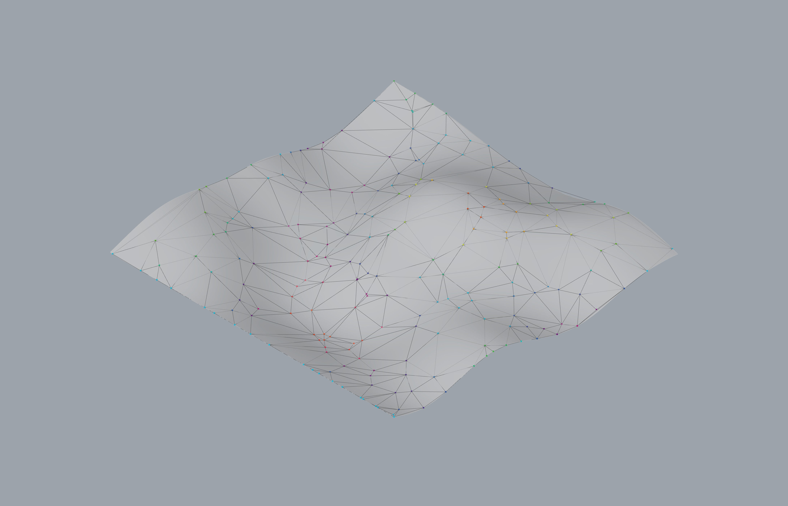

# Assignment 4: Agent-Based Modeling for Surface Panelization

[View on GitHub]({{ site.github.repository_url }})


## Table of Contents

- [Project Overview](#project-overview)
- [Pseudo-Code](#pseudo-code)
- [Technical Explanation](#technical-explanation)
- [Design Variations](#design-variations)
- [Challenges and Solutions](#challenges-and-solutions)
- [AI Acknowledgments](#ai-acknowledgments)
- [References](#references)

---

## Project Overview

This project implements an Agent-Based Model (ABM) for surface rationalization using Python in a Grasshopper environment. The process starts with the undulating surface geometry from Assignment 3, generated via Perlin Noise to define a heightmap. The core of the system lies in the Agent class, which is designed to sense and respond to the surface topography and its local neighbors. Agents use Curvature (Principal Direction) to align their movement along the geometric flow lines of the surface, creating coherent path trajectories. Concurrently, they use Slope (gradient magnitude) to apply resistance, slowing down in steep regions. These behaviors, combined with an agent-to-agent separation force to manage local density, ensure the resulting trajectories are geometrically informed, self-organizing and distributed across the surface.

---

## Pseudo-Code

### 1. Module-Level Structure

- `surface_generator.py` — Handles the procedural generation of the base surface using Perlin noise and NumPy, outputting a Rhino surface ID.
- `agent_builder.py` — Defines the Object-Oriented Agent class (state and behaviors) and the factory function for initial population.
- `agent_simulator.py` — Contains the simulation loop logic, manages the agent population over time and exports the agent trajectories for panelization


Outline:

```text
surface_generator.py
  - build_heightmap(divU, divV, params) -> np.ndarray
    # Generates a NumPy array (scalar field) used for surface deformation.

  - build_surface_from_heightmap(H_array, params) -> surface_id
    # Creates and returns the GUID of the final continuously curved Rhino/NURBS surface.

agent_builder.py
  - class Agent:
      attributes: uv, position, velocity, age, is_alive, path (history), geometry_signals, neighbors
      methods: 
        sense(agents, surface, vision_radius)
          # Reads local Curvature, Slope and identifies Neighbors, updating internal attributes.

        decide(sim_params)
          # Calculates Alignment, Resistance and Separation forces, updating self.velocity.

        move(surface)
          # Updates position and projects the agent back onto the surface, recording the path.

        update(agents, surface, sim_params) -> Agent
          # Calls sense, decide, move, updates life-cycle state and attempts to spawn a child.

  - build_agents(surface_id, n_agents, init_params) -> list[Agent]
    # Creates and returns the initial list of Agents at random positions on the surface.

agent_simulator.py
  - simulate(surface_id, agents, sim_params) -> (out_agents, out_points, out_vectors, out_paths)
    loop t in [0..T):
      for each agent:
        spawned_agent = agent.update(...)
      
      # Population management (kill/spawn) and recording of step results.
    
    post-process agent histories (paths) into panelization geometry.
    
    RETURN final list of Agents, Points (current position), Vectors (velocity) and Paths (trajectories).
```

### 2. Main Simulation Loop

Describe your main loop in clear pseudo-code, including:

- Initialization (surface, fields, agents, parameters).
- Per-step updates (sensing, decision-making, movement, life-cycle changes).
- How and when you record data for panelization (e.g., sample positions, trajectories, impact on tessellation).

### 3. Agent Class / Classes

- **Attributes**:
        position (3D Pt), 
        uv (2D tuple), 
        velocity (3D Vec), 
        age (int), 
        is_alive (bool), 
        path (list[3D Pt]), 
        curvature_dir (3D Vec), 
        slope_magnitude (float),
        neighbors (list[Agent])

- **Methods**:
        
  - `sense(agents, surface, vision_radius)`:
      - Geometric Signal Sampling: Samples local Curvature (curvature_dir) using rs.SurfaceCurvature. Slope Magnitude is calculated via finite differences around the UV point.
      - Spatial Influence: Identifies and stores all agents within vision_radius in self.neighbors.

  - `decide(sim_params)`:
    - Rules Application: Calculates forces based on sampled signals:
    - Alignment: Steering force applied toward curvature_dir, weighted by alignment_weight.
    - Resistance: Deceleration applied proportional to slope_magnitude.
    - Separation: Repulsion force applied away from neighbors, weighted by separation_weight.
    - Combination: Sums all forces, applies resistance and clamps the final velocity by max_speed.

  - `move(surface)`:
    - Position Change: Updates self.position by adding self.velocity.
    - Surface Constraint: Uses Rhino geometry methods (rs.SurfaceClosestPoint and rs.EvaluateSurface) to project the new position back onto the surface.
    - Trajectory Storage: Appends the final projected position to the self.path list.
  
  - `update(agents, surface, sim_params)`:
    - Orchestration: Calls sense, decide and move.
    - Life-Cycle: Checks and enforces kill rules (age > max_age or slope_magnitude > slope_kill_threshold).
    - Spawning: Executes the logic to potentially spawn and return a new agent based on curvature and local density checks.

  - `build_agents(surface_id, n_agents, init_params)`:
    - Initialization: Factory function to create the initial population of agents at random UV coordinates on the surface.

### 4. Panelization / Geometry Generation

Panel Construction Strategy: 
   
   1) Adjacency: Identify neighboring polylines based on proximity or initial UV position.
      
   2) Construction: Use the segments between sampled points on adjacent paths to define the four corner points of a panel, or use the curves to create Lofted strips.

Influence of Geometric Signals:
   - **Density / Size**: High **Curvature** leads to increased spawning (branching) and reduced agent speed, resulting in denser path networks and consequently **smaller panels**. Low curvature leads to larger, simpler panels.
   - **Orientation**: Agents align their movement with the Principal Curvature Direction. Therefore, the resulting panel **orientation** is inherently aligned with the geometric flow lines of the surface.

---

## Technical Explanation


### 1. Overall Pipeline

1. **Surface Generation** (`surface_generator.py`): A complex base surface is generated procedurally using Perlin Noise to create a heightmap. This heightmap deforms a flat grid into a continuous, complex NURBS surface (reused from Assignment 3).

2. **Agent Initialization** (`agent_builder.py`): The build_agents factory function creates the initial population of Agent objects, placing them at random UV coordinates on the base surface.

3. **Simulation Loop** (`agent_simulator.py`): The main Grasshopper component executes one simulation step per solution. Agents persist their state (position, velocity, path) between steps. Each agent performs its update() method, which calls:
    - Sense: Samples local geometry (Curvature, Slope) and neighbors.
    - Decide: Calculates steering forces (Alignment, Separation, Resistance).
    - Move: Updates position and projects back onto the surface.

### 2. Surface Generation and Fields

The simulation uses the undulating NURBS surface from Assignment 3, which is generated in surface_generator.py by applying a Perlin Noise-based heightmap to a planar grid of points.

- **Signals Computed**: **Curvature** (scalar and vector) and **Slope** (scalar and vector).
- **Mapping to Geometry**: The agent's 3D position is first mapped back to a precise UV coordinate using `rs.SurfaceClosestPoint(surface, point)`.
- **Curvature Representation**: The primary curvature vector is retrieved directly using `rs.SurfaceCurvature` at the agent's UV. This vector is then stored as `self.curvature_dir`.
- **Slope Representation**: Slope is approximated locally using finite differences (evaluating the surface at $P(u, v)$, $P(u + \Delta, v)$ and $P(u, v + \Delta)$). The magnitude of the resulting gradient vector is stored as the scalar `self.slope_magnitude`.

### 3. Geometric Signals and Agent Behaviors

- **Curvature (Alignment Signal)**:
  - **Response**: Agents use the **Principal Curvature Direction** (the direction of maximum curvature) as a target vector. A weighted steering force encourages the agent's current velocity to align with this direction.
  - **Rationale**: This forces agent trajectories to follow the natural flow lines of the surface, which is the key mechanism for rationalizing panel orientation.
- **Slope (Resistance Signal)**:
  - **Response**: Agents apply a Resistance Force (dampening) inversely proportional to the `slope_magnitude`.
  - **Rationale**: The agent effectively slows down in steep regions. This implicitly increases the density of points in areas that are challenging to construct, leading to smaller, more manageable panels in steep zones.
- **Distance / Spatial Influences (Separation)**:
  - **Response**: Agents repel nearby neighbors within a defined `vision_radius`. This is calculated as a vector sum of repulsive forces, where closer neighbors exert a stronger push.
  - **Combination**: *Alignemnt* and *Seperation* are summed to find a target acceleration. This acceleration is then applied to the agent's velocity and the resulting velocity is reduced by the slope-based Resistance and clamped by `max_speed`.

### 4. Agent Life-Cycle and Interactions
Life-cycle rules are used to dynamically manage the population and further influence the final pattern density.

- **Killing**: Agents are killed (`is_alive = False`) if they:
  1. Exceed a user-defined `max_age`.
  2. Encounter a slope where `slope_magnitude` is greater than a `slope_kill` threshold.

- **Spawning**: Agents have a chance to spawn a new agent. The probability is significantly increased in regions of high **absolute Mean Curvature**, but this spawning isn't done if the agent has too many neighbors.

### 5. Simulation

- **Simulation & Stopping**: The simulation runs one step per re-computation of the Grasshopper definition. There is no hard stop within the Python code; the user stops the process manually once the paths cover the surface or the population count stabilizes.

### 6. Multi-Module Design

The project is split into three key modules for modularity and clarity:

- `surface_generator.py`: Handles all geometric generation and NumPy-based Perlin Noise computation, isolating the base geometry logic.

- `agent_builder.py`: Defines the object-oriented structure (`Agent class`) containing all the state and behavior logic (`sense`, `decide`, `move`, life-cycle). This module is responsible for defining *what* the agents do.

- `agent_simulator.py`: Handles the Grasshopper pipeline execution, managing agent persistence, the main simulation loop and formatting the final list of agent paths/vectors for output. This module is responsible for the execution and data flow within the Grasshopper environment. 

This separation allows the complex agent behavior logic to be cleanly defined without mixing it with Grasshopper Components.

---

## Design Variations


### Parameter and Signal Table

| Design | Signals Used                     | Key Parameters                                              | Notes                                   |
|--------|----------------------------------|-------------------------------------------------------------|-----------------------------------------|
| A      | curvature + slope                | n_agents=200, vision_r=2.315, slope=8.878, allignment=1.0   | Denser paneling in high curvature area  |


### Variation 1: [Curvature/Slope]



- **Signals Used**: curvature + slope
- **Parameters Changed**: A low vision radius, high slope and low seperation gives dense panelization in high curvature areas.   
- **Description**: This demonstrates how emergent panel density and flow quality can be tuned using just two weighted parameters.

---

## Challenges and Solutions

| Challenge                        |                                                             | Solution                                |
|----------------------------------|-------------------------------------------------------------|-----------------------------------------|
| Insufficient Recursion Depth     | The simulation would abruptly crash after a few steps, throwing a `RecursionError`. This occurred because the continuous recompute loop in Grasshopper, which drives the simulation steps, can unintentionally exhaust Python's default recursion limit due to how the Rhino Python environment manages execution context.   | At the start of the `agent_simulator.py` script, the default Python recursion limit was manually increased to a sufficiently high value (here 2000 steps) to accommodate the continuous simulation flow. The following code was implemented to ensure stability: `try: sys.setrecursionlimit(2000) except Exception: pass` |
| Force Tuning and Interaction    | Achieving a balance between the three primary steering forces (allignment, seperation, resistance) was problematic. High alignment caused immediate clustering, while high separation destroyed geometric flow fidelity.   | The alignment force was softened by blending it gradually with the agent's current velocity (damping) rather than immediately applying the full steering vector. |
| Surface-Constrained Movement    | Agents moving freely in 3D space would drift off the surface, breaking the intended surface-based behavior.   | After movement, agents are projected back onto the surface using closest-point evaluation. This ensures all motion remains constrained to the underlying geometry. |
| Robust Geometric Signal Sampling    | Sampling curvature and slope on complex surfaces can fail due to invalid UV parameters, null geometry, or Rhino API inconsistencies.   | All geometric sampling functions were wrapped in safe checks and exception handling. Default fallback values are used to keep the simulation stable even when geometry queries fail. |

---

## AI Acknowledgments

- **Gemini (Google)** and **ChatGPT (OpenAI)**  Assisted in debugging complex architectural issues related to state persistence and module dependency within the Grasshopper environment, specifically guiding the input/output structure for continuous simulation loops. The model also aided in diagnosing and resolving stability problems like insufficient Python recursion depth and provided assistance with understanding and finding relevant RhinoScriptSyntax API usage. The following are prompts which have been used and gives an example of how prompts were structured and used.
  - *"My Code crashes with a RecursionError. The simulation logic seems to work, but it's executed recursion depth. What is a solution to prevent it?"*
  - *"I have my Agent class in agent_builder.py and my loop in agent_simulator.py. How can I make sure that the entire list is correctly passed between, while being a list and not just each object?"*
  - *""I need to calculate the final velocity vector by Alignment, Separation and Resistance. What approach should I use to turn it into a usable vector?"*

---

## References


- **Python in Rhino and Grasshopper**
  - [Rhino.Python Guides](https://developer.rhino3d.com/guides/rhinopython/)
  - [RhinoScriptSyntax Reference](https://developer.rhino3d.com/api/RhinoScriptSyntax/)
  - [McNeel Forum](https://discourse.mcneel.com/)

- **Python Software**
  - [Python Software Foundation (sys)](https://docs.python.org/3/library/sys.html)